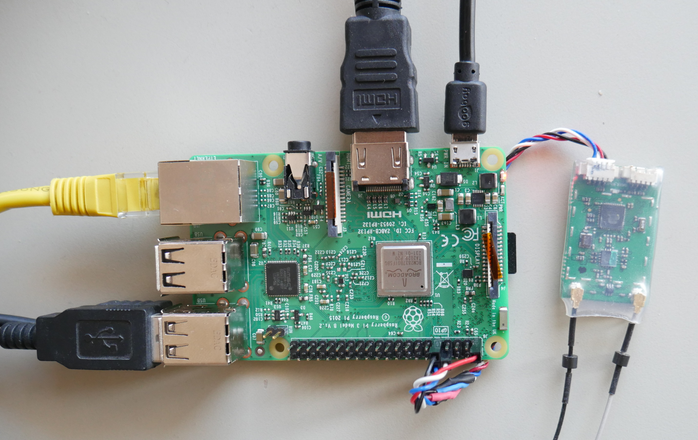
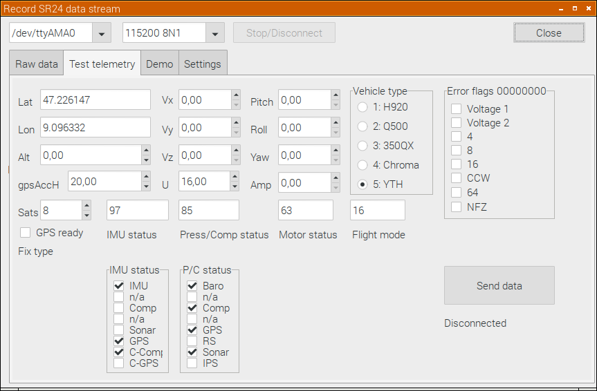

# SR24_decode
SR24 is a ZigBee transmitter used for Yuneec drones. 
For tests and analysis the transmitter will be connected to Raspberry PI.

A test tool helps to create own applications for SR24.

The tool can receive all messages from Radio controller ST10, ST12, ST16 and ST24. Also test messages (fake drone telemetry data) can be sent to analyze behavior of the Radio control unit.
One can send different values back to ST16 just to see how it reacts. The Demo shows how the messages from the ST16 can used by program and is able to control two servos.

The executable is running with Raspian+GUI on Raspberry Pi.

st16cars.lpr is an example how you can control a model car (or ship) by ST10 or ST16.
It runs as terminal program and should be started at boot time. No GUI. It uses rc_settings.set for configuration.
